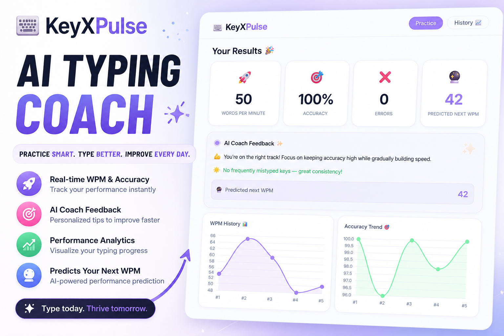

# ⌨️ KeyXPulse — AI Typing Coach ✨

<p align="center">
  <a href="https://keyxpulse.vercel.app/">
    
  </a>
</p>

<p align="center">
  <b>A modern AI-assisted typing coach that analyzes your performance and helps you improve.</b><br/>
  Track your WPM, accuracy, and receive intelligent feedback — all in a clean, minimal UI.
</p>

<p align="center">
  <a href="https://keyxpulse.vercel.app/">🌐 Live Demo</a> •
  <a href="https://github.com/KarthikeshwarAnanthapur/KeyXPulse">💻 GitHub</a>
</p>

<p align="center">
  
  
  
</p>

---

## 🚀 Overview

Most typing apps only measure speed.

**KeyXPulse goes further** — it analyzes how you type and provides actionable insights to help you improve over time.

---

## 🌟 Features

| Feature | Description |
|--------|------------|
| ⏱ **Time Control** | Choose from 10s → 5min typing sessions |
| ⌨️ **Live Typing Feedback** | Real-time character validation (✔ / ✖) |
| 🚫 **No Backspace Mode** | Forces intentional and accurate typing |
| 📊 **Live Metrics** | WPM, Accuracy & Errors updated instantly |
| 🧠 **AI Coach Feedback** | Personalized insights after each session |
| 🔑 **Weak Key Detection** | Identifies frequently mistyped characters |
| 🔮 **WPM Prediction** | Predicts your next performance using recent sessions |
| 📈 **Progress Analytics** | Interactive charts for WPM & accuracy trends |
| 💾 **Session History** | Stores and tracks progress using localStorage |
| ⏰ **Visual Timer** | Animated SVG ring timer with urgency feedback |
| 📱 **Responsive Design** | Seamless experience across all devices |

---

## 🎨 Tech Stack

| Layer | Technology |
|------|-----------|
| **Frontend** | React 18 |
| **Build Tool** | Vite 5 |
| **Charts** | Chart.js + react-chartjs-2 |
| **Styling** | Custom CSS (minimal + aesthetic UI) |
| **State & Logic** | React Hooks |
| **Storage** | localStorage |
| **Deployment** | Vercel |

---

## 🗂 Project Structure
```
KeyXPulse/
├── index.html
├── vite.config.js
├── package.json
├── vercel.json
├── README.md
└── src/
    ├── main.jsx              ← React entry point
    ├── App.jsx               ← Root app (tabs, keyboard shortcuts)
    ├── index.css             ← All global styles
    ├── components/
    │   ├── Header.jsx        ← Logo + tab navigation
    │   ├── Controls.jsx      ← Duration selector, ring timer, buttons
    │   ├── TypingArea.jsx    ← Word display + input (backspace blocked)
    │   ├── LiveStats.jsx     ← WPM / Accuracy / Errors cards
    │   ├── Results.jsx       ← Post-test results panel
    │   ├── AIFeedback.jsx    ← AI suggestion + weak keys + prediction
    │   ├── Charts.jsx        ← Chart.js WPM & accuracy line charts
    │   ├── History.jsx       ← Session history table + charts
    │   └── Toast.jsx         ← Toast notification system
    ├── hooks/
    │   └── useTypingTest.js  ← All typing test state & logic
    └── utils/
        ├── wordBank.js       ← Random word generation
        ├── storage.js        ← localStorage helpers
        └── aiLogic.js        ← AI suggestions, weak keys, WPM prediction
```
---

## 🎯 How to Use

1. Select a typing duration  
2. Click **Start** (or press `Enter`)  
3. Begin typing — timer starts automatically  
4. View your results and AI feedback  
5. Track your progress in the **History** tab  

---

## ⌨️ Keyboard Shortcuts

| Key | Action |
|-----|--------|
| `Enter` | Start test |
| `Escape` | Reset test |
| `Backspace` | Disabled (challenge mode) |

---

## 🧠 AI System

- **Smart Feedback** → Suggests improvements based on accuracy & speed  
- **Weak Key Detection** → Tracks most frequent typing mistakes  
- **Performance Prediction** → Estimates your next WPM using recent data  

---

## 🚀 Getting Started (Local Setup)

```bash
git clone https://github.com/KarthikeshwarAnanthapur/KeyXPulse.git
cd KeyXPulse
npm install
npm run dev